# LinkUp Architecture Documentation

## 🏗️ System Overview

LinkUp is a modern web application designed to solve team formation challenges at hackathons through intelligent matching and seamless Discord integration. The architecture follows a clean, scalable design with separation of concerns.

## 🔧 Tech Stack

### Frontend
- **Framework**: Next.js 14 with App Router
- **Styling**: Tailwind CSS + Headless UI
- **State Management**: React Context + Zustand
- **UI Components**: Custom components with Framer Motion animations
- **Authentication**: NextAuth.js with Discord OAuth2

### Backend
- **Runtime**: Node.js with Next.js API Routes
- **Database**: MongoDB with Mongoose ODM
- **Authentication**: Discord OAuth2
- **File Storage**: Cloudinary (for profile images)
- **Rate Limiting**: Built-in middleware

### Infrastructure
- **Hosting**: Vercel
- **Database**: MongoDB Atlas
- **CDN**: Vercel Edge Network
- **Environment**: Environment variables for configuration

## 📐 System Architecture

### High-Level Architecture

```mermaid
graph TB
    subgraph "Client Layer"
        A["🌐 Next.js Frontend<br/>React Components"]
        B["📱 Responsive UI<br/>Tailwind CSS"]
        C["🔄 State Management<br/>Zustand + Context"]
    end
    
    subgraph "API Layer"
        D["🔗 Next.js API Routes"]
        E["🛡️ Authentication<br/>NextAuth.js"]
        F["⚡ Rate Limiting<br/>Middleware"]
    end
    
    subgraph "Business Logic"
        G["🧠 Matching Engine<br/>Algorithm"]
        H["👤 User Management"]
        I["💬 Chat Integration"]
    end
    
    subgraph "Data Layer"
        J["🗄️ MongoDB Atlas<br/>User Profiles"]
        K["🔗 Discord API<br/>OAuth & Connections"]
        L["☁️ Cloudinary<br/>Image Storage"]
    end
    
    A --> D
    B --> A
    C --> A
    D --> E
    D --> F
    D --> G
    D --> H
    D --> I
    G --> J
    H --> J
    I --> K
    H --> L
    E --> K
```



## 🔄 User Flow Diagram

```mermaid
flowchart TD
    A["🏠 Landing Page"] --> B["🔐 Discord Login"]
    B --> C{"📝 Profile Complete?"}
    C -->|No| D["✏️ Create Profile<br/>Skills, Interests, Goals"]
    C -->|Yes| E["🏠 Dashboard"]
    D --> E
    E --> F["🔍 Discover People"]
    F --> G["👆 Swipe Interface"]
    G --> H{"💝 Match?"}
    H -->|❌ No| F
    H -->|✅ Yes| I["🎉 Match Notification"]
    I --> J["💬 Discord Connection"]
    J --> K["🤝 Team Formation"]
    E --> L["👥 My Teams"]
    E --> M["📊 Profile Settings"]
    M --> D
```



## 🗄️ Database Schema


## 🔗 API Endpoints

### Authentication
- `GET /api/auth/discord` - Discord OAuth login
- `GET /api/auth/callback` - OAuth callback handler
- `POST /api/auth/logout` - User logout

### User Management
- `GET /api/users/me` - Get current user profile
- `PUT /api/users/me` - Update user profile
- `GET /api/users/:id` - Get user by ID (for matches only)
- `POST /api/users/upload-avatar` - Upload profile picture

### Matching & Swiping
- `GET /api/discover` - Get potential matches
- `POST /api/swipe` - Record a swipe (like/pass)
- `GET /api/matches` - Get user's matches
- `POST /api/matches/:id/accept` - Accept a match

### Teams
- `GET /api/teams` - Get user's teams
- `POST /api/teams` - Create a new team
- `PUT /api/teams/:id` - Update team details
- `POST /api/teams/:id/join` - Join a team

## 🧠 Matching Algorithm

The matching algorithm considers multiple factors to suggest compatible teammates:

### Scoring Factors
1. **Skill Complementarity** (40% weight)
   - Overlapping skills for collaboration
   - Complementary skills for diversity
   
2. **Interest Alignment** (30% weight)
   - Shared interests and project types
   - Similar hackathon goals
   
3. **Availability Match** (20% weight)
   - Compatible timezones
   - Similar commitment levels
   
4. **Tech Stack Compatibility** (10% weight)
   - Preferred technologies and frameworks
   - Experience levels

### Algorithm Flow
```
1. Filter out already swiped users
2. Calculate compatibility scores
3. Apply user preferences (team size, roles)
4. Sort by score and randomize within tiers
5. Return top 20 candidates
```

## 🔐 Security Considerations

### Authentication & Authorization
- Discord OAuth2 for secure authentication
- JWT tokens for session management
- Rate limiting on API endpoints
- Input validation and sanitization

### Data Privacy
- User profiles private until matched
- No personal data sharing without consent
- Discord handles stored securely
- Optional profile visibility settings

### Security Headers
- CORS configuration for trusted domains
- CSRF protection on state-changing operations
- Secure cookie settings
- XSS protection headers

## 🚀 Deployment Strategy

### Development
- Local development with hot reloading
- MongoDB local instance or Atlas connection
- Environment variables for secrets

### Production
- **Frontend**: Vercel with automatic deployments
- **Database**: MongoDB Atlas with connection pooling
- **CDN**: Vercel Edge Network for global distribution
- **Monitoring**: Vercel Analytics and error tracking

### Performance Optimizations
- Next.js automatic code splitting
- Image optimization with next/image
- API route caching strategies
- Database indexing on frequently queried fields

## 📱 Mobile Responsiveness

The application is designed mobile-first with:
- Touch-friendly swipe gestures
- Responsive grid layouts
- Optimized images and lazy loading
- Progressive Web App (PWA) capabilities

## 🔮 Future Enhancements

### Phase 2 Features
- Real-time chat integration
- Video call integration for team meetings
- Advanced filtering and search
- Team recommendation engine
- Integration with MLH and Devpost

### Scalability Considerations
- Microservices architecture for growth
- Redis caching layer
- Load balancing strategies
- Database sharding for large user bases

---

*This architecture supports LinkUp's mission to revolutionize hackathon team formation through intelligent matching and seamless user experience.*
